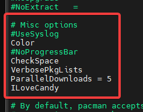

# UdOS
UdOS semestral work

The goal of this project is to create a easy instalation and distribution of the scripts

Packages needed for this install are: git $EDITOR

$EDITOR = any console based editor like: nano, vim, neovim, micro, ...

## Pre-Instalation
For this install you will need git and your editor of choice since for full experience you will need to change couple of configuration files, everything will be detailed bellow.
### pacman.sh

```bash
sudo $EDITOR /etc/pacman.conf
```


Uncomment (remove #) from lines: color, VerbosePkgLists, ParalelDownloads

Alternatively you can add line ILoveCandy to make pacman pretty

then run pacman.sh script

```bash
chmod +x pacman.sh
./pacman.sh
```

### plymouth.sh
Plymouth is an application which provides a graphical boot experience for Linux.

```bash
sudo $EDITOR /etc/mkinitcpio.conf
```

append plymouth at the end of the HOOKS parameter


```bash
sudo $EDITOR /etc/default/grub
```
append the quiet splash under parameter GRUB_CMDLINE_LINUX_DEFAULT


then run the script

```bash
chmod +x plymouth.sh
./plymouth.sh
```

## During-Instalation
you will be asked to write certain package names, link for reference

https://github.com/adi1090x/plymouth-themes

https://github.com/VandalByte/dedsec-grub2-theme
## Post-instalation
### nerdfonts.sh
script to install nerdfonts, open the file and comment (add # at the begging of the line) which fonts you do not want to install, be aware this script can take a long time to install
```bash
chmod +x nerdfonts.sh
./nerdfonts.sh
```