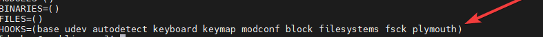
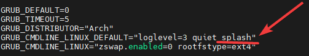

# UdOS
UdOS semestral work

The goal of this project is to create a easy installation and distribution of the scripts to install essential part of the system

The packages needed for this installation are git and your chosen console-based editor ($EDITOR)

in coomands replace: $EDITOR for any console based editor like: nano, vim, neovim, micro, ...


## Pre-installation
For this install you will need git and your editor of choice as you will need to modify several configuration files for the full experience, everything will be detailed bellow.

Making these modifications are not necesarry to perform, but for full experience it is advised to also make these changes
### plymouth.sh
Plymouth is an application which provides a graphical boot experience for Linux.

```bash
sudo $EDITOR /etc/mkinitcpio.conf
```

append 'plymouth' at the end of the HOOKS parameter




```bash
sudo $EDITOR /etc/default/grub
```
append 'splash' to the GRUB_CMDLINE_LINUX_DEFAULT parameter

you can also append 'quiet' if you want to suppress error and warning messages



then run the script

```bash
chmod +x plymouth.sh
./plymouth.sh
```

https://github.com/adi1090x/plymouth-themes \
https://aur.archlinux.org/packages?O=0&K=adi1090x&SeB=nd&SB=p


## During-installation
you will be asked to provide certain package names. Refer to the following links for more information

https://github.com/VandalByte/dedsec-grub2-theme \


to start the install clone this repository, make main.sh executable and launch it
```bash
cd
git clone https://github.com/ordinaryDamian/UdOS
cd UdOS
chmod u+x main.sh
./main.sh
```
## Post-installation
### nerdfonts.sh
script to install nerdfonts, open the file and comment (add # at the begging of the line) to fonts which you do not want to install, be aware this script can take a long time to install
```bash
chmod +x nerdfonts.sh
./nerdfonts.sh
```
After full installation was performed it is advised to fully restart the system
### Themes
You can install themes via ocs-url from websites like kdestore.com \
https://www.pling.com/s/All-Linux/p/1277095\
https://www.pling.com/p/1661959\
https://www.pling.com/p/1661959\
https://www.pling.com/p/1738703\
https://www.pling.com/p/1464332


